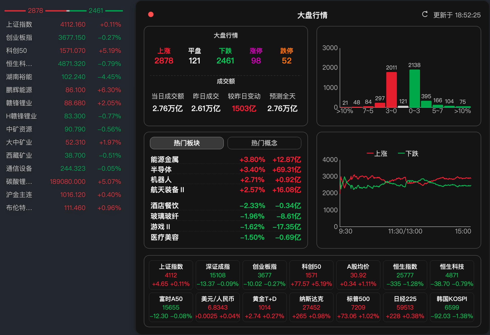

# myStocks


**所有代码纯`AI`驱动, 完全没有牛马味儿**

一个基于 Qt6 的桌面悬浮看盘工具，面向 macOS 与 Windows，适合常驻桌面快速查看自选、指数、板块、港股与期货行情。

## 截图预览



## 项目简介

`myStocks` 强调低打扰、快读取和高可定制。

它不是传统的大而全交易终端，而是一个适合放在桌面边缘、托盘常驻、随时扫一眼市场状态的小工具。你可以把它当作主交易软件之外的第二屏信息层，用更轻的方式盯自选、看热点、看分时、看盘面强弱。

## 功能亮点

- 悬浮窗常驻展示，支持自选股、指数、板块、港股、期货混合监控
- 托盘常驻与全局快捷键，一键显示或隐藏主窗口
- 鼠标悬停分时图弹窗，快速查看日内走势、均价线与刷新状态
- 市场宽度详情弹窗，支持上涨/平盘/下跌、涨停/跌停、成交额和时间线概览
- 热门板块与热门概念展示，方便观察盘中情绪和热点轮动
- 高度可定制的界面配置：列显示、列顺序、列宽、字体、颜色、透明度、置顶、双击隐藏、鼠标穿透
- 可配置网络行为：`User-Agent`、代理、日志、轮询频率
- 支持检查 GitHub Release 更新并下载当前平台安装包

## 适用场景

- 边工作边盯自选，不想一直停留在交易软件界面
- 通过轻量悬浮窗快速观察盘面强弱、题材热度和市场情绪
- 给主交易终端补一个更适合常驻桌面的辅助信息层

## 平台与技术栈

- macOS
- Windows
- Qt 6
- C++17
- CMake

## 快速开始

### 下载发布版

可直接前往 [GitHub Releases](https://github.com/log2c/myStocks/releases) 下载对应平台的压缩包。

### 本地构建

#### macOS

```bash
brew install cmake qt ninja
cmake --preset dev-debug
cmake --build --preset dev-debug
```

说明：
如果本机使用 Homebrew 安装 Qt，项目会优先自动探测常见的 Qt6 安装路径。

#### Windows

安装 Qt 6、CMake 和 Ninja 后，执行：

```bash
cmake -S . -B build -G Ninja -DCMAKE_BUILD_TYPE=Release -DQt6_DIR="你的Qt6_DIR路径"
cmake --build build --parallel
```

## 配置说明

- 默认自选列表可写在仓库根目录的 `data.yaml`
- 程序也支持从 `~/.myStocks/data.yaml` 读取自选列表
- 首次启动后会生成 `settings.ini` 保存界面与网络配置
- 可在设置窗口中调整热键、外观、列布局、透明度、分时图、市场宽度和代理等选项

示例 `data.yaml`：

```yaml
ver: 1

stocks:
  - code: 1.600519
    name: 贵州茅台
```

## 目录结构

- `include/`：核心头文件，包含配置、数据模型、窗口与类型定义
- `src/`：应用主逻辑实现
- `assets/`：图标与托盘相关静态资源
- `apis/`：接口整理与抓包记录
- `data.yaml`：示例自选列表

## 授权说明

本项目采用仓库内的 [LICENSE](LICENSE) 发布。

你可以在非商业场景下自由使用、学习、修改和分发本项目源码及其衍生版本，但不得将本项目或其衍生版本直接或间接用于商业用途。

补充说明：
严格来说，“禁止商用”不符合 OSI 对开源许可证的定义，因此本项目更准确的表述是“源码公开（source-available）”，而不是传统意义上的“OSI 开源许可证”。

## 鸣谢

- 爱盯盘：产品形态与看盘体验灵感
- 摸鱼看盘：轻量悬浮看盘思路参考
- 东方财富：部分行情与搜索接口参考来源

本项目与以上产品、服务或品牌均无官方关联。

## 免责声明

- 本项目仅供学习、研究与个人非商业使用
- 行情数据与展示内容不构成任何投资建议
- 因接口变动、网络异常或第三方服务调整导致的问题，项目不承诺持续可用性
